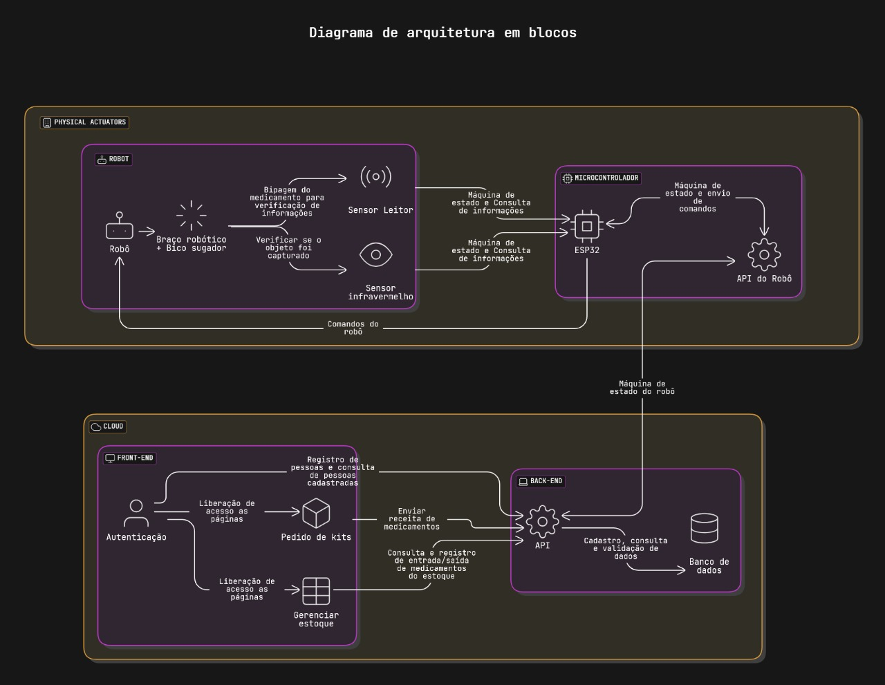

# Diagrama de Blocos

&emsp; A aplicação Pharmabot foi arquitetada em distintas camadas referentes ao nível te atuação dos componentes e tecnologias envolvidas na solução. A separação por camadas de aplicação permite uma organização mais clara e modular do código-fonte, o que facilita manutenções e futuras implementações no código. Abaixo se encontra o diagrama de blocos da arquitetura elaborada, viabilizando fácil entendimento sobre o sistema a ser desenvolvido.

Figura 1 - Diagrama de Blocos da Arquitetura

Fonte: Elaboração própria (2025)

## Camada Cloud

### Front-End

### Back-End

## Camada dos Atuadores Físicos

&emsp; 

### Robô

### Microcontrolador