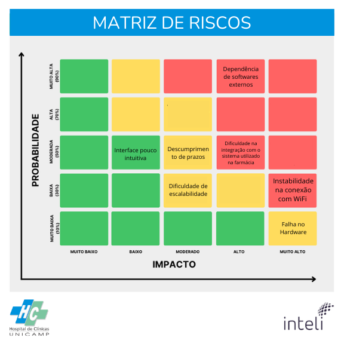

# Matriz de Riscos e Oportunidades

&emsp;A Matriz de Riscos é uma ferramenta fundamental em diversos setores para avaliar e priorizar riscos com base em sua probabilidade de ocorrência e impacto. Ela consiste em uma tabela em que os riscos são categorizados em diferentes níveis - aqui representados como muito baixo, baixo, moderado, alto e muito alto, além de uma paleta de cores alternando entre vermelho, amarelo e verde. Como uma ferramenta dinâmica, a matriz precisa ser constantemente revisada e ajustada para acompanhar a evolução dos riscos e das condições operacionais. Esse processo se torna especialmente relevante em contextos onde é necessário priorizar riscos, sejam eles ameaças (negativos) ou oportunidades (positivos), ajudando na elaboração de planos de ação eficazes [(MINETTO, 2019)](../referencias.md).

&emsp;O processo iterativo da Matriz de Riscos leva em consideração a natureza mutável dos riscos: novos riscos podem surgir, os existentes podem alterar seu impacto ou probabilidade, e as estratégias de mitigação podem precisar ser ajustadas. Revisões periódicas são essenciais para garantir que a matriz reflita com precisão o ambiente de riscos atual, aprimorando a gestão de riscos e permitindo que as organizações aperfeiçoem suas técnicas de avaliação.

### Matriz de Riscos

Figura 2 - Matriz de Riscos

Fonte: Elaboração própria (2025)

&emsp;Nota-se através das figuras 1 e 2, a identificação dos riscos e oportunidades eminentes do projeto PharmaBot, facilitando a tomada de decisões estratégicas e o planejamento de ações. A natureza iterativa dessa gestão garante que esses gráficos sejam constantemente atualizados, refletindo as alterações na avaliação dos impactos e probabilidades dos riscos.

&emsp;Além das figuras supracitadas, a tabela Z apresenta um plano de ação abrangendo os riscos identificados nesta seção, de maneira a traçar estratégias para inibir ou mitigar os riscos considerados para o desenvolvimento do projeto.

&emsp;Entre os riscos com maior probabilidade e impacto, destaca-se a "Dependência de softwares externos", se referindo à utilização de dados advindos de outros softwares para o funcionamento ótimo de nossa aplicação. Uma vez que, dada a falta de conexão WiFi, nossa aplicação não se comunica entre os diferentes aplicativos necessários para seu funcionamento e, em eventuais ruídos de comunicação entre a equipe desenvolvedora e o Hospital de Clínicas da Unicamp, as dores do parceiro podem não ser sanadas. Compreende-se, portanto, os riscos "Instabilidade na conexão com WiFi" e "Entendimento incorreto das dores do cliente" como riscos consideráveis, apesar de seu baixo risco de ocorrência.

---

### Matriz de Oportunidades

Figura 2 - Matriz de Oportunidades

Fonte: Elaboração própria (2025)

&emsp;Na matriz de oportunidades apresentada, destaca-se o "Fácil integração com softwares externos" como uma oportunidade de muito alto impacto e alta probabilidade. Esta condição pode abrir portas para colaborações valiosas, acesso a recursos avançados e entrada em mercados novos ou pouco explorados. Ainda, o tópico "Grupo de desenvolvimento engajado", posicionado como de médio impacto e alta probabilidade representa otimização na produtividade e qualidade do desenvolvimento do trabalho, contribuindo para a eficiência do projeto. Ademais, podemos destacar a oportunidade "Experiências em Web Dev", de nosso time de desenvolvedores, como grande aliada no processo de desenvolvimento da aplicação PharmaBot. A exploração dessas oportunidades pode potencializar os resultados do desenvolvimento, de forma a otimizar o aproveitamento de recursos e maximizar o proveito sobre o projeto.

---

### Plano de Ações

&emsp;Portanto, a matriz de riscos é uma ferramenta amplamente versátil e aplicável a uma variedade de áreas e situações, servindo para a tomada de decisões informadas e ponderadas sobre riscos e oportunidades. Sua natureza iterativa a torna essencial para a gestão eficaz de projetos, permitindo uma análise contínua para prevenir problemas e garantir o aproveitamento de oportunidades. Essa análise foi realizada com o objetivo de auxiliar o grupo a entender e lidar com possíveis ameaças e oportunidades no contexto do projeto, visando uma maior assertividade no processo decisório. Deste modo, chegamos nos seguintes planos de ação:

| \#  | Plano de ações:                                                                                                                                                                                                                                                                            |
| --- | ------------------------------------------------------------------------------------------------------------------------------------------------------------------------------------------------------------------------------------------------------------------------------------------ |
| 1   | **Dependência de softwares externos:** Para mitigar a dependência dos softwares externos utilizados na farmácia, utiliza-se uma *middleware* (camada intermediária) para armazenar os dados a serem trabalhados, para casos de desconexão com o software terceiro. |
| 2   | **Dificuldade na integração com o sistema utilizado na farmácia:** Desenvolver uma documentação detalhada para evitar erros na aquisição de dados, além do tratamento dos dados recebidos para formatação adequada aos softwares externos. Ademais, buscamos o desenvolvimento de uma API facilmente configurável, para possíveis casos de troca de sistema externo e/ou diferenças entre versões.                               |
| 3   | **Instabilidade na conexão com Wi-Fi:** Garantir o funcionamento do robô separador para que funcione, independentemente do status da conexão Wi-Fi e manter últimos dados recebidos da API salvos localmente.                                    |
| 4   | **Falha no hardware:** Utilização de pontos de checagem na movimentação do robô para garantir que, uma vez que o robô não atingir o desempenho esperado, garantir que nenhum medicamento seja selecionado de maneira errônea e interromper sua atuação e enviar relatório de erro para futuras implementações.                                                                                            |                                                             |
| 5   | **Dificuldade de escalabilidade:** Garantir a independência dos serviços presentes na solução, elaborar extensa e detalhada documentação do funcionamento das funcionalidades de nossa aplicação Web e controle do hardware.                                                                                 |
| 6   | **Interface pouco intuitiva:** Realização de testes de usabilidade com público-alvo para adequar a disposição de recursos e ajustas funcionalidades para melhor seus objetivos.                                                                                                                                            |