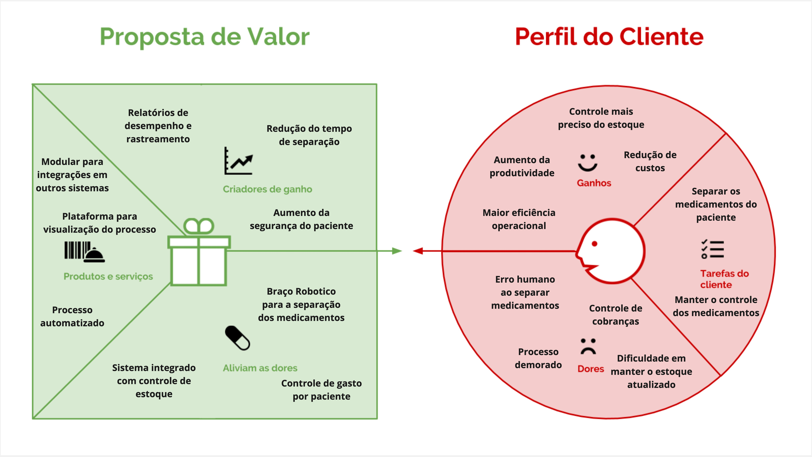

# Canvas Proposta de Valor

## Introdução

&emsp; O Canvas da Proposta de Valor, é uma ferramenta de gestão estratégica que permite visualizar e analisar a proposta de valor de um produto ou serviço. O Canvas é dividido em duas partes: o Perfil do Cliente e o Mapa de Valor. O Perfil do Cliente descreve as características do público-alvo, enquanto o Mapa de Valor apresenta os benefícios e diferenciais da solução proposta. O Canvas da Proposta de Valor é uma ferramenta simples e eficaz para identificar as necessidades dos clientes e criar produtos ou serviços que atendam às suas expectativas.

&emsp; A seguir, são apresentados os seis blocos que compõem o Canvas da Proposta de Valor, com uma breve descrição de cada um deles sobre o projeto:

Figura 1 - Value Proposition Canvas (Canvas da Proposta de Valor)

Fonte: Elaboração própria (2025)

## Segmentos de Clientes

&emsp; O segmento de clientes do projeto é composto pelos farmacêuticos e a equipe da farmácia, beneficiados pela redução de tempo e erros na separação de medicamentos, e os pacientes internados, que recebem medicamentos de forma mais segura e eficiente.

#### Dores:

&emsp; **Erro humano ao separar medicamentos:** Falhas humanas podem causar consequências graves, como administração de medicamentos errados, doses incorretas ou até mesmo omissão de medicamentos essenciais para o tratamento.

&emsp; **Controle de cobranças:** Dificuldade em rastrear com precisão o consumo de medicamentos por paciente, o que pode levar a cobranças incorretas e problemas financeiros para o hospital e os pacientes.

&emsp; **Dificuldade em manter o estoque atualizado:** O controle manual do estoque é suscetível a erros, como registros incompletos ou duplicados, que podem levar à falta de medicamentos essenciais ou acúmulo desnecessário de itens.

&emsp; **Processo demorado:** A montagem manual da “Fita de medicamentos” é lenta e ineficiente, exigindo um grande número de profissionais para realizar tarefas repetitivas que poderiam ser automatizadas.

#### Tarefas do Cliente:

&emsp; **Separar os medicamentos do paciente:** Assegurar que cada paciente receba a medicação correta, na dosagem apropriada e no momento exato, evitando riscos de administração incorreta que possam comprometer a segurança do paciente.

&emsp; **Manter o controle dos medicamentos:** Garantir a atualização constante do estoque com registros detalhados do uso de cada medicamento, prevenindo tanto o desperdício quanto a falta de insumos essenciais.

#### Ganhos:

&emsp; **Redução de custos:** Diminuição significativa da necessidade de intervenção manual, resultando em menor demanda por mão de obra e otimização do uso de medicamentos, reduzindo desperdícios.

&emsp; **Maior eficiência operacional:** Automação integrada dos processos de separação e montagem da "Fita de Medicamentos", reduzindo o tempo operacional em até 40% e aumentando a produtividade da equipe.

&emsp; **Controle mais preciso de estoque:** Implementação de um sistema de rastreamento em tempo real que integra com o sistema de gestão hospitalar, garantindo acurácia e controle rigoroso sobre o inventário de medicamentos.

&emsp; **Aumento da produtividade:** Liberação da equipe de farmácia para atividades mais analíticas e estratégicas, promovendo um ambiente de trabalho mais eficiente e focado em tarefas de maior valor agregado.

## Proposta de Valor

&emsp; A propsta de valor do projeto é oferecer uma solução de automação para a separação de medicamentos, que reduz o tempo e os erros no processo, garantindo a segurança e eficiência na administração de medicamentos aos pacientes internados.

#### Produtos e Serviços:

&emsp; **Sistema de automação para separação de medicamentos:** Integração de manipuladores robóticos de alta precisão e sensores inteligentes para garantir a correta identificação, separação e dosagem dos medicamentos.

&emsp; **Plataforma para visualização do processo:** Interface intuitiva e amigável que permite o monitoramento em tempo real, possibilitando ajustes rápidos e eficientes, bem como o rastreamento completo de cada medicamento.

&emsp; **Modular para integrações em outros sistemas:** Ferramentas modulares para comunicação direta com o sistema de gestão hospitalar, permitindo a atualização automática de prescrições médicas e o controle de estoque de forma integrada.

#### Criadores de Ganhos:

&emsp; **Redução do tempo de separação:** Otimização dos fluxos de trabalho através da automação, reduzindo o tempo de separação de medicamentos em até 40%, aumentando a agilidade no atendimento aos pacientes.

&emsp; **Aumento da segurança do paciente:** Implementação de tecnologias que minimizam os riscos de erros humanos na separação e administração de medicamentos, garantindo maior segurança e confiabilidade no processo.

&emsp; **Relatórios de desempenho e rastreamento:** Geração de relatórios detalhados que permitem o monitoramento contínuo da eficiência do processo, com dados sobre o uso de medicamentos, tempo de processamento e incidência de erros.

#### Alívio de Dores:

&emsp; **Braço Robotico para a separação dos medicamentos:** Reduz drasticamente a ocorrência de erros humanos, garantindo maior precisão e rapidez na separação dos medicamentos, além de melhorar a consistência do processo.

&emsp; **Integração com o sistema de gestão hospitalar:** Simplifica o controle de estoque e facilita a atualização de prescrições médicas, proporcionando um fluxo de informações mais eficiente e preciso.

&emsp; **Controle de gasto por paciente:** Assegura transparência nas cobranças com registros detalhados do consumo de medicamentos por paciente, evitando erros financeiros e contribuindo para uma gestão de custos mais eficaz.

&emsp; Com isso, o Canvas da Proposta de Valor apresenta uma visão abrangente dos segmentos de clientes, dos ganhos e dores, dos trabalhos do cliente, da proposta de valor, dos criadores de ganhos, dos analgésicos e dos produtos e serviços oferecidos pela solução proposta.