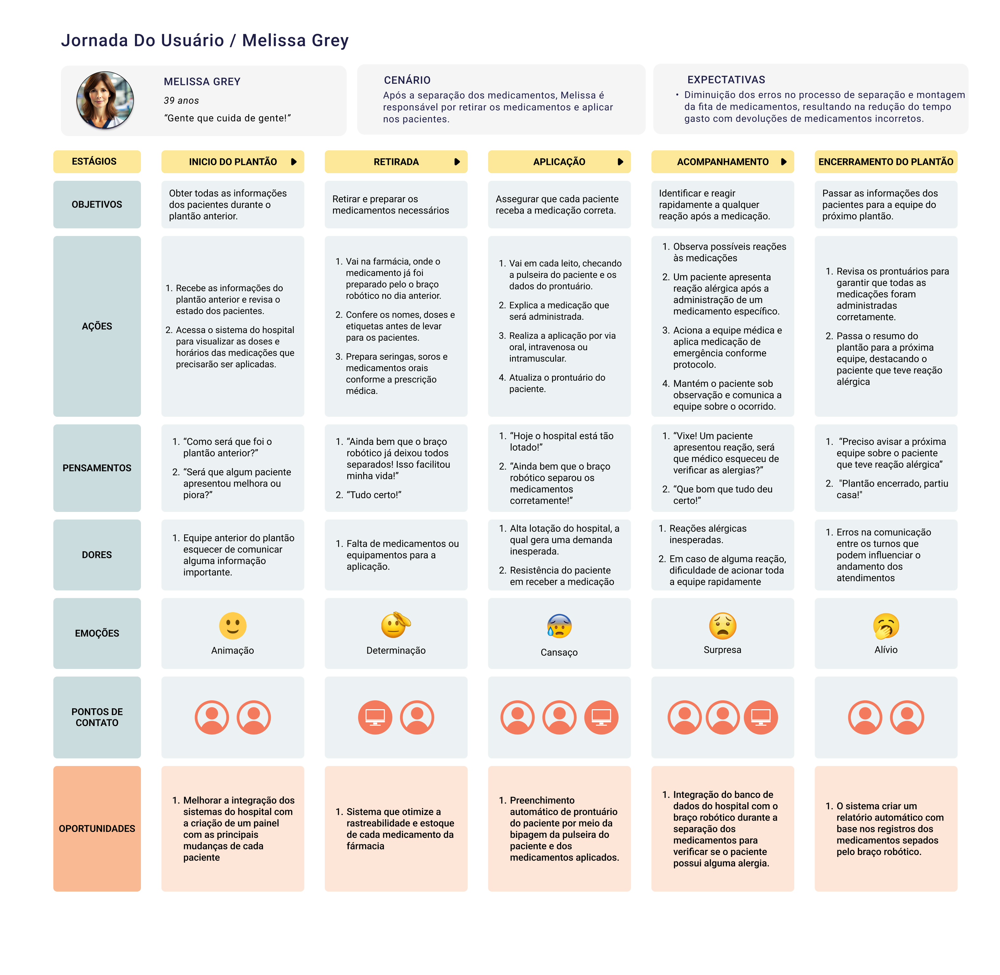

# Jornada do usuário

&emsp; A Jornada do Usuário é uma representação visual do caminho que um usuário percorre ao interagir com um produto, serviço ou sistema. Nesse sentido,ela descreve as etapas, as emoções, as ações e os pontos de contato que o usuário experimenta ao longo de sua interação. Dessa maneira, a jornada do usuário é uma ferramenta valiosa para identificar oportunidades de melhoria, pontos de atrito e necessidades não atendidas, permitindo que a equipe de design e desenvolvimento crie soluções mais eficazes e centradas no usuário (Kalbach, 2016).

## Jornada do usuário - Melissa Grey

&emsp; A imagem a seguir apresenta a jornada do usuário da Melissa Grey, uma enfermeira que utiliza a solução do braço robótico para a separação de medicamentos na etapa de retirada e devoluções de medicamentos.

Figura 2 - Jornada do usuário Melissa Grey

Fonte: Autoria própria 

 [Link da imagem](https://www.figma.com/design/SCx7di2PpOWX5wA33AR4Do/Personas?node-id=0-1&t=pfqqtjVnvypbkFJu-1)

### Etapas da jornada da Melissa Grey

**1. Inicio do plantão**

- **Objetivo:** Obter todas as informações dos pacientes durante o plantão anterior.

- **Ações:** 
    1. Recebe as informações do plantão anterior e revisa o estado dos pacientes.
    2. Acessa o sistema do hospital para visualizar as doses e horários das medicações que precisarão ser aplicadas.

- **Pensamentos:** 
    1. “Como será que foi o plantão anterior?”
    2. “Será que algum paciente apresentou melhora ou piora?”

- **Dores:**
    1. Equipe anterior do plantão esquecer de comunicar alguma informação importante.

- **Emoções:** Animação

- **Oportunidades:** 
    1. Melhorar a integração dos sistemas do hospital com a criação de um painel com as principais mudanças de cada paciente 

**2. Retirada dos medicamentos**

- **Objetivo:** Retirar e preparar os medicamentos necessários

- **Ações:** 
    1. Vai na farmácia, onde o medicamento já foi preparado pelo o braço robótico no dia anterior.
    2. Confere os nomes, doses e etiquetas antes de levar para os pacientes.
    3. Prepara seringas, soros e medicamentos orais conforme a prescrição médica.

- **Pensamentos:** 
    1. “Ainda bem que o braço robótico já deixou todos separados! Isso facilitou minha vida!”
    2. “Tudo certo!”

- **Dores:**
    1. Falta de medicamentos ou equipamentos para a aplicação.

- **Emoções:** Determinação

- **Oportunidades:** 
    1. Sistema que otimize a rastreabilidade e estoque de cada medicamento da fármacia

**3. Aplicação dos medicamentos**

- **Objetivo:** Assegurar que cada paciente receba a medicação correta.

- **Ações:** 
    1. Vai em cada leito, checando a pulseira do paciente e os dados do prontuário.
    2. Explica a medicação que será administrada.
    3. Realiza a aplicação por via oral, intravenosa ou intramuscular.
    4. Atualiza o prontuário do paciente.

- **Pensamentos:** 
    1. “Hoje o hospital está tão lotado!”
    2. “Ainda bem que o braço robótico separou os medicamentos corretamente!”

- **Dores:**
    1. Alta lotação do hospital, a qual gera uma demanda inesperada.
    2. Resistência do paciente em receber a medicação.

- **Emoções:** Cansaço

- **Oportunidades:** 
    1. Preenchimento automático de prontuário do paciente por meio da bipagem da pulseira do paciente e dos medicamentos aplicados

**4. Acompanhamento dos pacientes**

- **Objetivo:** Identificar e reagir rapidamente a qualquer reação após a medicação.

- **Ações:** 
    1. Observa possíveis reações às medicações
    2. Um paciente apresenta reação alérgica após a administração de um medicamento específico.
    3. Aciona a equipe médica e aplica medicação de emergência conforme protocolo.
    4. Mantém o paciente sob observação e comunica a equipe sobre o ocorrido.

- **Pensamentos:** 
    1. “Vixe! Um paciente apresentou reação, será que o médico esqueceu de verificar as alergias?” 
    2. “Que bom que tudo deu certo!”

- **Dores:**
    1. Reações alérgicas inesperadas.
    2. Em caso de alguma reação, dificuldade de acionar toda a equipe rapidamente

- **Emoções:** Surpresa

- **Oportunidades:** 
    1. Integração do banco de dados do hospital com o braço robótico durante a separação dos medicamentos para verificar se o paciente possui alguma alergia.

**5. Encerramento do plantão**

- **Objetivo:** Passar as informações dos pacientes para a equipe do próximo plantão.

- **Ações:** 
    1. Revisa os prontuários para garantir que todas as medicações foram administradas corretamente.
    2. Passa o resumo do plantão para a próxima equipe, destacando o paciente que teve reação alérgica.

- **Pensamentos:** 
    1. “Preciso avisar a próxima equipe sobre o paciente que teve reação alérgica”
    2. "Plantão encerrado, partiu casa!"

- **Dores:**
    1. Erros na comunicação entre os turnos que podem influenciar o andamento dos atendimentos

- **Emoções:** Alívio

- **Oportunidades:** 
    1. O sistema criar um relatório automático com base nos registros dos medicamentos separados pelo braço robótico.

&emsp; A jornada do usuário da Melissa Grey dastaca como a introdução de um braço robótico na separação de medicamentos pode otimizar o fluxo de trabalho, reduzir erros e melhorar a rotina de trabalho da equipe de enfermagem. Ao longo de sua rotina, Melissa enfrenta muitos desafios como a falta de informações na troca de plantões, reações alérgicas inesperadas e, principalmente, a alta demanda hospitalar. No entanto, a automação da separação de medicamentos contribui para um processo mais ágil para a equipe hospitalar e seguro para os pacientes.