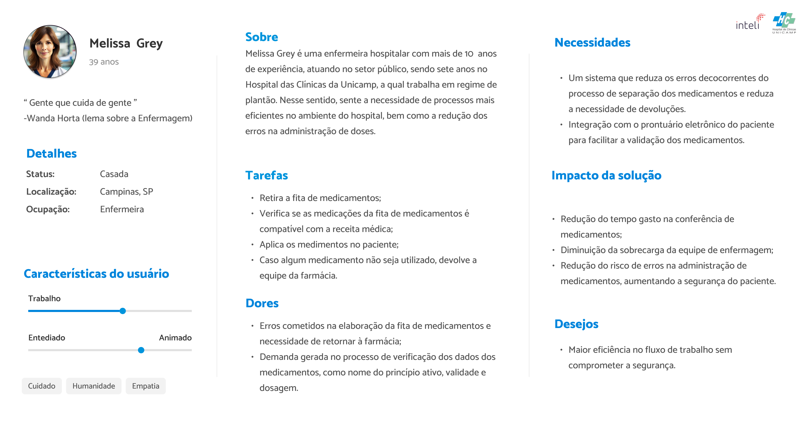

# Persona

## Lara Oliveira, Farmacêutica

&emsp;&emsp;A persona Lara Oliveira é uma farmacêutica no Hospital das Clínicas da Unicamp, a persona foi construída com base nas atividades e responsabilidades de uma farmacêutica na farmácia de um hospital, considerando que ela será uma das responsáveis por utilizar a solução robótica após a implementação.

Figura 1 - Persona: Farmacêutica Lara Oliveira

Fonte: Autoria própria

**Detalhes:**

- **Nome:** Lara Oliveira
- **Idade:** 34 anos
- **Ocupação:** Farmacêutica
- **Localização:** Campinas, SP
- **Status:** Casada

**Sobre:**

&emsp;&emsp;Lara é farmacêutica no Hospital das Clínicas da Unicamp, ela se formou em Farmácia na própria Unicamp há 5 anos e desde então trabalha no mesmo hospital. Sempre foi muito meticulosa e atenta a suas tarefas, pois durante a faculdade ouviu muitos casos de pacientes que tiveram problemas relacionados a medicamentos fora da validade, pacientes alérgicos a medicamentos específicos e furtos de medicamentos psicotrópicos.

**Tarefas:**

- Controle de qualidade dos medicamentos (verificação do estado físico, data de validade, etc)
- Orientar pacientes sobre o uso e a dose correta de cada medicamento
- Acompanhar os usos e efeitos dos medicamentos nos pacientes
- Responsável por emitir ordens de compra de medicamentos conforme disponibilidade no estoque

**Dores:**

- Preocupação constante com a possibilidade de erro humano na separação dos medicamentos
- Furto de medicamentos controlados e caros
- Falta de controle do estoque

**Necessidades:**

- Um sistema que registre de forma automática a entrada e saída de medicamentos do estoque, além de permitir consultar informações sobre os pacientes e sobre quais medicamentos ele recebeu

**Impactos com a solução:**

- Menos tempo contando o estoque, facilitando o processo de controle do estoque
- Maior facilidade no pedido de reabastecimento do estoque, uma vez que vai ter controle em tempo real das quantidades de cada medicamento no estoque
- Mais tranquilidade, pois o processo de separação foi automatizado, excluindo a possibilidade de erro humano
- Facilita o seu trabalho de checagem dos medicamentos
- Facilita a consulta da relação entre medicamentos e pacientes
- Facilita o processo de devolução de medicamentos

## Melissa Grey, Enfermeira

&emsp;A persona que representa o enfermeiro é Melissa Grey, cuja construção foi baseada na Pesquisa Perfil da Enfermagem, realizada pela Fiocruz (Fundação Oswaldo Cruz) por iniciativa do Cofen (Conselho Federal de Enfermagem). Nesse sentido, essa pesquisa apresenta um diagnóstico da situação dos enfermeiros, técnicos e auxiliares de enfermagem em atuação no Brasil. Assim, os dados coletados nessa pesquisa embasaram a construção da persona Melissa, assegurando uma representação correta dos enfermeiros.

&emsp; A pesquisa completa pode ser acessada neste [link](https://www.cofen.gov.br/perfilenfermagem/pdfs/relatoriofinal.pdf) e o resumo pode ser acessado no seguinte [link](https://www.cofen.gov.br/perfilenfermagem/blocoBr/QUADRO%20RESUMO_Brasil_Final.pdf).

Figura 2 - Persona Melissa Grey

Fonte: Autoria própria 

 [Link da imagem](https://www.figma.com/design/SCx7di2PpOWX5wA33AR4Do/Personas?node-id=0-1&t=pfqqtjVnvypbkFJu-1)

**Detalhes:**

- **Nome:** Melissa Grey
- **Idade:** 39 anos
- **Ocupação:** Enfermeira
- **Localização:** Campinas, SP
- **Status:** Casada

**Sobre:**

&emsp; Melissa Grey é uma enfermeira hospitalar com mais de 10  anos de experiência, atuando no setor público, sendo sete anos no Hospital das Clínicas da Unicamp, a qual trabalha em regime de plantão. Nesse sentido, sente a necessidade de processos mais eficientes no ambiente do hospital, bem como a redução dos erros na administração de doses.

**Tarefas:**

- Retira a fita de medicamentos;
- Verifica se as medicações da fita de medicamentos é compatível com a receita médica;
- Aplica os medimentos no paciente;
- Caso algum medicamento não seja utilizado, devolve a equipe da farmácia. 

**Dores:**

- Erros cometidos na elaboração da fita de medicamentos e necessidade de retornar à farmácia;
- Demanda gerada no processo de verificação dos dados dos medicamentos, como nome do princípio ativo, validade e dosagem. 

**Necessidades:**

- Um sistema que reduza os erros decocorrentes do processo de separação dos medicamentos e reduza a necessidade de devoluções.
- Integração com o prontuário eletrônico do paciente para facilitar a validação dos medicamentos.

**Impactos com a solução:**

- Redução do tempo gasto na conferência de medicamentos;
- Diminuição da sobrecarga da equipe de enfermagem;
- Redução do risco de erros na administração de medicamentos, aumentando a segurança do paciente.

**Desejos:**

- Maior eficiência no fluxo de trabalho sem comprometer a segurança.

**Por que a persona da Melissa Grey?**

&emsp; Melissa Grey, enfermeira hospitalar no Hospital das Clínicas da Unicamp, tem 39 anos e atua na medicação dos pacientes. Nesse sentido, sua escolha como persona foi baseada na representatividade dos enfermeiros e técnicos de enfermagem que entre suas tarefas durante o plantão incluem a aplicação de medicamentos aos pacientes, ou seja, que utilizarão a presente solução do braço robótico.